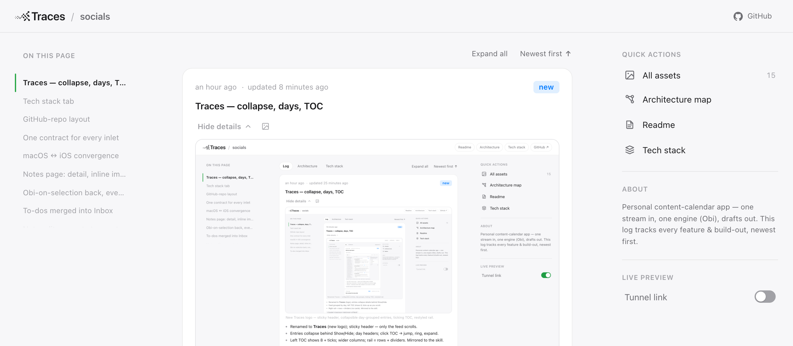

# Traces (a Claude Code skill)



**Traces** is a reusable system that gives any repo a **persistent, user-facing progress
log** — a self-contained `progress/index.html` laid out like a GitHub repo page:

- a **top bar** with the Traces wordmark + your repo name;
- a **left table-of-contents** that shows 8 items at a time and *ticks* (animates) to keep
  the current entry centered as you scroll (sliding marker, click to jump);
- a **centered feed** of every feature and build-out — newest first, **grouped by day**
  (Today, Yesterday, …) with **collapsible details** (each entry tucks its bullets, media,
  and branch behind a *Show details* toggle; recent work opens by default);
- a **right rail** of quick actions (an **All assets** grid, Architecture, Readme) and an
  About blurb.

Plus an **Architecture** tab that stays current, status pills, condense + per-post delete,
relative times, and optional one-tap live preview over a Cloudflare tunnel.

## Add Traces to your agent
Three ways, one layout — the repo is plugin-shaped (`skills/traces/SKILL.md`), which every
channel understands:

```bash
# 1. npx (Vercel skills CLI) — installs the skill straight from GitHub
npx skills add tjcages/traces

# 2. Claude Code plugin (the repo is its own marketplace)
/plugin marketplace add tjcages/traces
/plugin install traces@traces

# 3. Clone + symlink (how it's developed here)
git clone https://github.com/tjcages/traces ~/Workspace/traces
ln -s ~/Workspace/traces/skills/traces ~/.claude/skills/traces
```

## Where it lives
The source of truth is this standalone repo at **`~/Workspace/traces`** (git remote
`github.com/tjcages/traces`). The skill payload sits at **`skills/traces/`**; Claude Code
auto-discovers skills under `~/.claude/skills/`, so it's **symlinked** in —
`~/.claude/skills/traces` → `~/Workspace/traces/skills/traces` — like the other
workspace-hosted skills (`apple-ui`, `web-ui`). Develop it in the workspace; it loads through
the symlink. Nothing is hosted on a server — it's local files.

## Install the log into a repo
Once the skill is available, scaffold the progress log into any project:
```bash
bash ~/.claude/skills/traces/scripts/install.sh --mode rule
#   rule   = scaffold + always-on rule in the repo's CLAUDE.md   (recommended)
#   hook   = rule + a Stop hook that blocks finishing if code changed but the log didn't
#   manual = scaffold only (invoke the skill by hand)
```
Idempotent — never clobbers existing entries; refreshes the engine + scripts.

## Use it
- Slash commands: **`/progress`** or **`/changelog`** (then describe what changed).
- Or just ask: "update the progress log."
- The full method agents follow is the scaffolded `progress/README.md`.

## Live preview (opt-in)
Default is local-only. Flip `progress/preview.json` `"tunnel": true` (or tick the checkbox
at the bottom of the hosted page) and an agent will run `scripts/progress-tunnel.sh` and
hand you a tappable link.

## Share it
See **Add Traces to your agent** above (npx / plugin / clone). To hand someone a
self-contained bundle instead, `bash skills/traces/scripts/package.sh` builds
`dist/traces-v<VERSION>.skill` (a zip with `SKILL.md` at its root) for claude.ai's Skills
uploader or `npx skills add ./traces-v<VERSION>.skill`.

## What's inside
- `.claude-plugin/` — `plugin.json` (the Claude Code plugin manifest) + `marketplace.json`
  (makes the repo its own one-plugin marketplace).
- `skills/traces/SKILL.md` — the method + install/usage Claude loads.
- `skills/traces/templates/` — `index.html` (the log engine), `architecture.html` +
  `architectures.data.js` (the Architecture tab), `about.html` (in-page guide), `stack.html`
  (tech-stack page), `README.md` (the protocol), `preview.json`, `claude-block.md` (injected rule).
- `skills/traces/scripts/` — `install.sh`, `sync-engine.mjs` (move the engine between the
  template and a live install without touching its entries — see below), `progress-server.py` (serves +
  accepts the checkbox write), `progress-tunnel.sh`, `progress-shot.mjs` (real-viewport
  screenshots), `progress-standalone.mjs`, `package.sh` (build the `.skill` bundle).

## Improving the engine (dogfood loop)
This repo **self-hosts** its own log (`progress/`), so you can iterate the engine against a
real page. `index.html` fuses engine + data in one self-contained file, and `install.sh`
won't overwrite an install's `index.html` (it would wipe entries) — so `sync-engine.mjs`
does the safe splice, validating + backing up every write:
```bash
node scripts/sync-engine.mjs push <repo>   # ship an engine update INTO an install (keeps its entries + About)
node scripts/sync-engine.mjs pull <repo>   # capture engine work done IN an install back into the template
#                                 …add --dry to preview without writing
```
Typical loop: edit `templates/index.html` → `push .` to preview on the self-host → `push`
to consumers (e.g. socials). The sibling engine pages (`architecture.html`, `about.html`)
refresh via `install.sh`.
